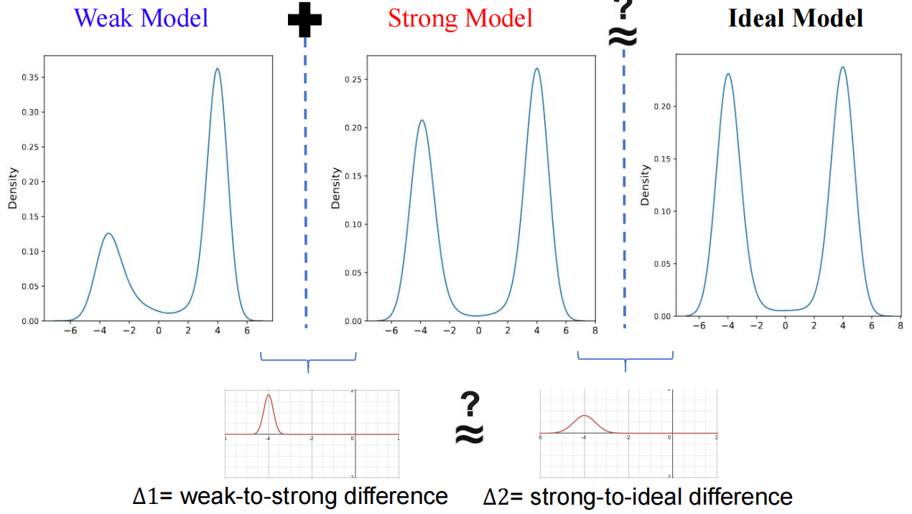
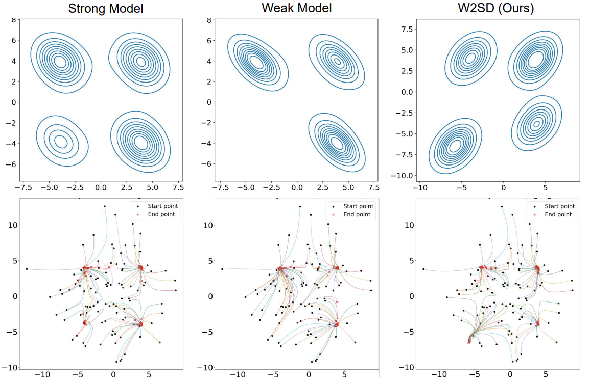
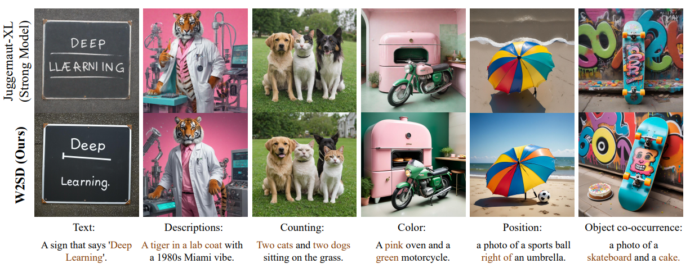
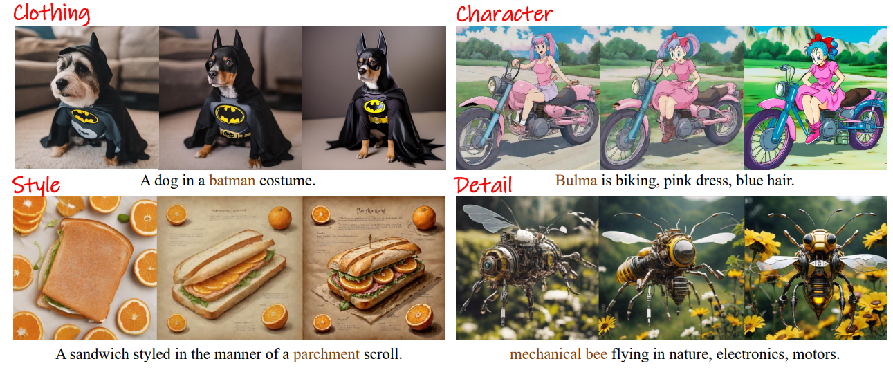
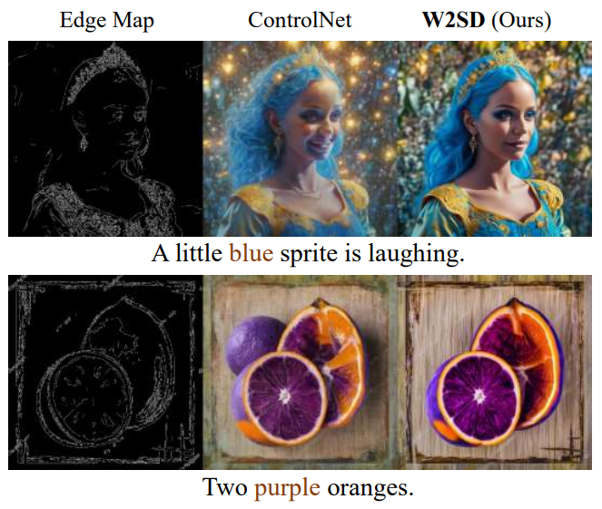

## Overview

We propose Weak-to-Strong Diffusion (W2SD), a novel framework that utilizes the estimated difference between existing weak and strong models (i.e., weak-to-strong difference) to approximate the gap between an ideal model and a strong model. By employing a reflective operation that alternates between denoising and inversion with weak-to-strong difference, we theoretically understand that W2SD steers latent variables along sampling trajectories toward regions of the real data distribution. W2SD is highly flexible and broadly applicable, enabling diverse improvements through the strategic selection of weak-to-strong model pairs (e.g., DreamShaper vs. SD1.5, good experts vs. bad experts in MoE).

This guide offers detailed instructions on utilizing W2SD, an innovative sampling framework that employs a weak-to-strong model pairing strategy to refine variable latent representations, bringing them closer to the ground truth.

Here we provide the inference code which supports ***Weight Difference***. More architectures will be released later.

## Results
### 1D Case
<div align="center">
  
  <p>W2SD leverages the gap between weak and strong models to approximate the gap between strong and ideal models.</p>
</div>

### 2D Case
<div align="center">
  
  <p>W2SD balances the learned distribution, bringing it closer to the real data distribution.</p>
</div>

### Enhancing Human Preference
<div align="center">
  
  <p>The qualitative results of W2SD demonstrate the effectiveness of our method in various aspects, such as position, color, counting, and beyond. Here we set Juggernaut-XL as strong model and SDXL as weak model.</p>
</div>

### Enhancing Personalized Generation
<div align="center">
  
  <p>Qualitative comparisons with weak model (left), strong model (middle) and W2SD (right). Our method utilizes the differences between chosen strong and weak models (e.g., high-detail LoRA vs. standard model) to deliver improvements in various dimensions, including style, character, clothing, and beyond.</p>
</div>

### Enhancing Alignment with Control Conditions
<div align="center">
  
  <p> Qualitative results of W2SD based on pipeline difference. We set ControlNet as strong model pipeline and DDIM as weak model pipeline. W2SD improves alignment with reference images.</p>
</div>

## Requirements

- `python version == 3.10.14`
- `pytorch with cuda version`
- `diffusers == 0.22.3`
- `PIL`
- `numpy`
- `timm`
- `tqdm`
- `argparse`
- `einops`

## Installation🚀️

Make sure you have successfully built `python` environment and installed `pytorch` with cuda version. Before running the script, ensure you have all the required packages installed. Specifically, you need to install the `diffusers` library with a specific version.

```bash
pip install diffusers == 0.22.3
```

## Usage👀️ 

To use the W2SD, you need to run the `w2sd_lora.py` with appropriate command-line arguments. Below are the available options:

### Command-Line Arguments

- `--weak_lora_scale`: The LoRA scale used by weak model. Default is -1.5.
- `--strong_lora_scale`: The LoRA scale used by strong model. Default is 1.5.
- `--weak_guidance_scale`: The classifier free guidance scale used by weak model. Default is 1.0.
- `--strong_guidance_scale`: The classifier free guidance scale used by weak model. Default is 5.5.
- `--size`: The size (height and width) of the generated image.  Default is 1024.
- `--T`: Number of inference timesteps. Default is 50.
- `--seed`: Random seed to determine the initial latent.
- `--lora_path`: The path of dpo lora ckpt.
- `--prompt`: Condition text prompt for generation.
- `--save_dir`: Path to save the generated images. Default is `./res`.

### Running the Script

You can execute the inference step by running the following command:
```bash
python ./w2sd_lora.py
```
This command will execute the generation process, generating images corresponding to the `predefined prompts` under both `weak model` and `strong model` and `w2sd`.

You can also modify these prompts in `w2sd_lora.py` to the content you want.


### Output🎉️ 

The composed images will be saved to the directory designated by `--save_dir`.

## Evaluate📈

You can also run  `evaluate.py` to evaluate the results of the method.

We provide two datasets, `Pick-a-Pic` and `DrawBench`, along with four metrics: `PickScore`, `HPS`, `ImageReward`, and `AES`.

## Pre-trained Weights Download❤️

You need to manually or automatically download the SDXL model via Hugging Face. Please ensure a stable internet connection and the correct version.

**Note**: The LoRA DPO checkpoint can be downloaded from CivitAI at the following link: https://civitai.com/models/124347/xlmoreart-full-xlreal-enhancer. Please place the downloaded file in the `--lora_path`


If you encounter any issues with deployment and operation, you are kindly invited to contact us, thank you very much!

# Citing

If you find our code useful in your research, please cite our paper.

```bibtex
@article{bai2025weak,
  title={Weak-to-Strong Diffusion with Reflection},
  author={Bai, Lichen and Sugiyama, Masashi and Xie, Zeke},
  journal={arXiv preprint arXiv:2502.00473},
  year={2025}
}
```
